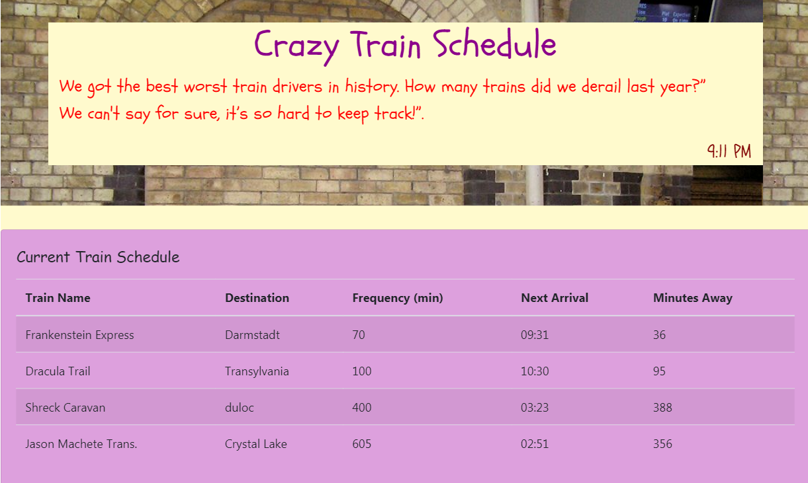

# train Schedule

- To view this page: [Train Schedule Link](https://mguaraz120.github.io/train-time-page/)
- My Portfolio:https://mguaraz120.github.io/Portfolio/
- My Linkedin Page:https://www.linkedin.com/in/mario-vizcaino-187ab9104/

## Description:

The user inputs new train name, start time and frequency to schedule. Then, it displays the schedule in repeating table with next arrival based on current time and frequency of train stops. Stores Train info in Firebase for data persistence and retrieves information from database on load.

## Application Image

## Technology

---

- Javascript
- jQuerry
- HTML
- CSS3
- Firebase
- Moment.js
